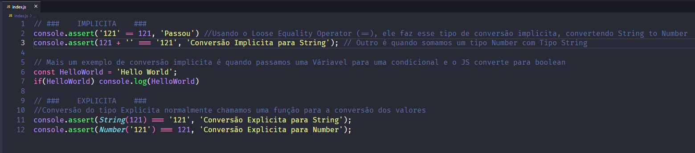

## Conversão de Tipos

###

    NPM COMMAND    node index.js

###

    Conversão de tipos é um processo de conversão de dados para outro como Number to String, String to Number 
    No JavaScript qualquer dado está sujeito a esta conversão, seja ela implicita ou explicita 
    Os tipos primitivos só podem ser convertido para três valores, String, Number e Boolean 

    A maneira mais comum dessas conversões implicitas acontecerem é quando usamos o  
    Loose Equality Operator (==) Ao Invés do Strict Equality Operator (===) 
    A soma do tipo Number com String, ou passamos uma váriavel não booleana em uma condicional (if)

###

